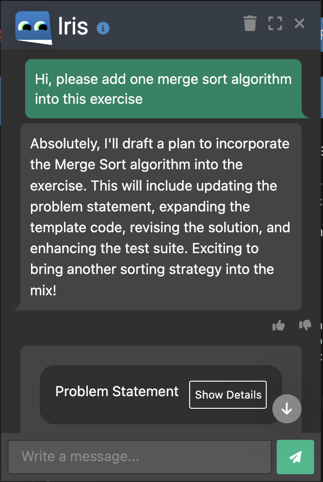
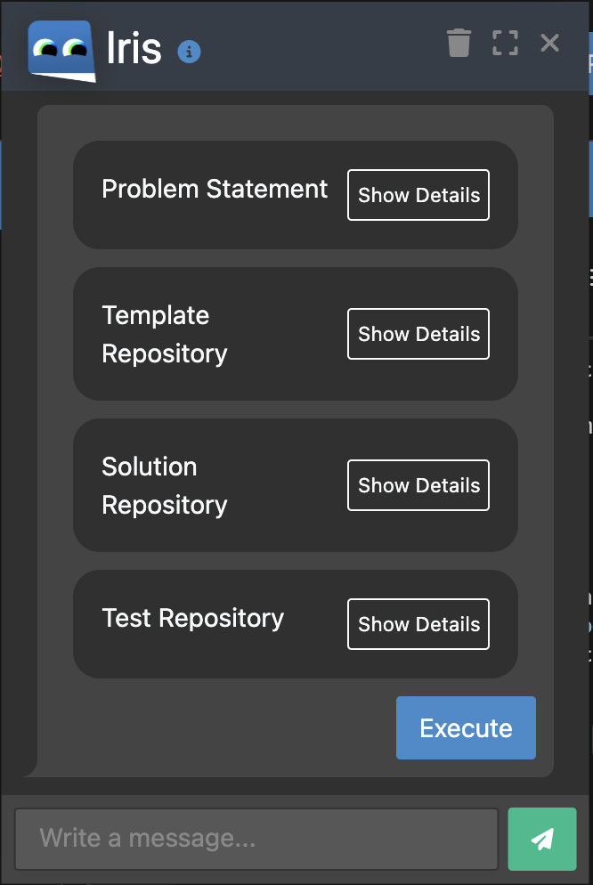

Welcome to the Exercise Creation Experiment! In this interactive session, your objective is to adapt programming exercises to meet specific requirements with the assistance of Iris.

Here's a step-by-step guide on how the process works:

- **Submit Your Request**:
Enter your exercise adaptation requirements.
- **Review the Action Plan**:
Inspect the proposed action plan generated by Iris.
- **Accept or Request Changes**:
Choose to accept the plan as is or request modifications.
- **Wait for Implementation**:
Allow time for the requested changes to be applied.
- **Inspect the Changes**: 
Review the modified exercise.
Request additional fixes if needed or make manual corrections.

The associated user interface is depicted in the following figures.

During your work, please remember to initiate a screen recording and don't use alternative AI tools.

Thank you for participating in the Exercise Creation Experiment! Happy coding!

## Experiment 1: Applying Content Changes

**Task:** Your task is to replace binary searching algorithm with jump searching algorithm within the programming exercise.

**Procedure:**

1. Login Artemis with a tutor account 
2. Go to **Iris Experimental Study Course 2**
3. Choose one of the **Searching algorithm strategy** programming exercise (each tutor needs to choose different exercises) and open it in online editor (click “Edit in editor”)
4. Start to record your screen
5. Go through the four components(problem statement, template repository, solution repository and test repository) of the exercise
6. Use Iris to implement the adaptation
7. After adaptation, the build of the template repository should succeed but fail all test cases (0% passed) and the solution repository should pass 100% tests cases

## Experiment 2: Making an Exercise Harder
**Task:** Your task is to increase the difficulty by removing some prefilled code in the template and adding tasks to re-add the code.

**Procedure:**

1. Login Artemis with a tutor account 
2. Go to **Iris Experimental Study Course 2**
3. Choose one of the **Binary search algorithm** programming exercise (each tutor needs to choose different exercises)
4. Start to record your screen
5. Go through the four components(problem statement, template repository, solution repository and test repository) of the exercise
6. Use Iris to implement the adaptation
7. After adaptation, the build of the template repository should succeed but fail all test cases (0% passed) and the solution repository should pass 100% tests cases

## Experiment 3: Adding a Creative Theme

**Task:** Your task is to add a creative theme (e.g. animal, fruit, etc.) to the programming exercise, enhancing its appeal and comprehensibility for students.

**Procedure:**

1. Login Artemis with a tutor account 
2. Go to **Iris Experimental Study Course 2**
3. Choose one of the **Bubble sort algorithm** programming exercise (each tutor needs to choose different exercises)
4. Start to record your screen
5. Go through the four components(problem statement, template repository, solution repository and test repository) of the exercise
6. Use Iris to implement the adaptation
7. After adaptation, the build of the template repository should succeed but fail all test cases (0% passed) and the solution repository should pass 100% tests cases

**After completing the experiments, please fill out the survey: [Iris Exercise Creation](https://xinyao.limesurvey.net/684711?lang=en)**