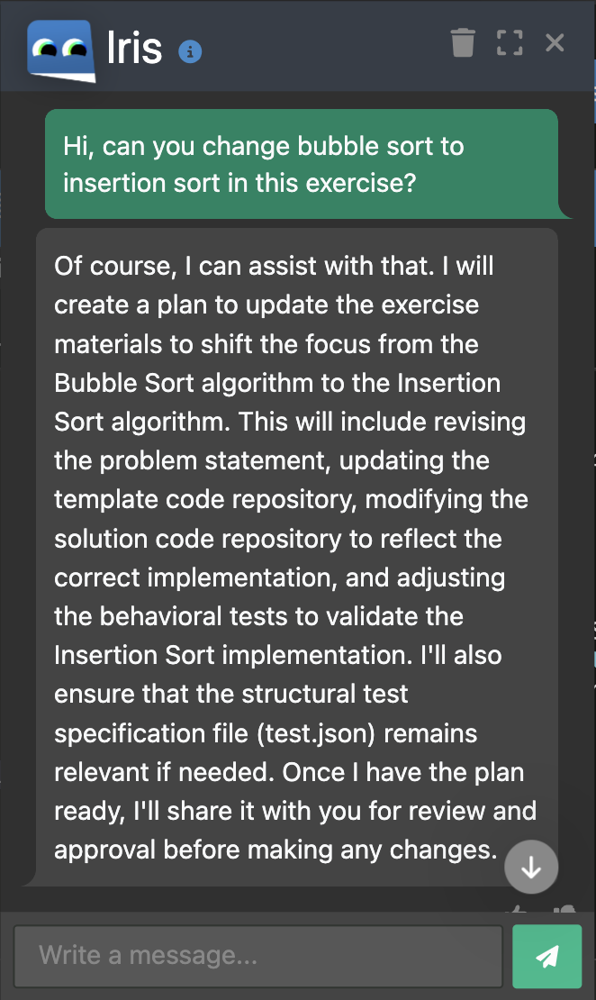
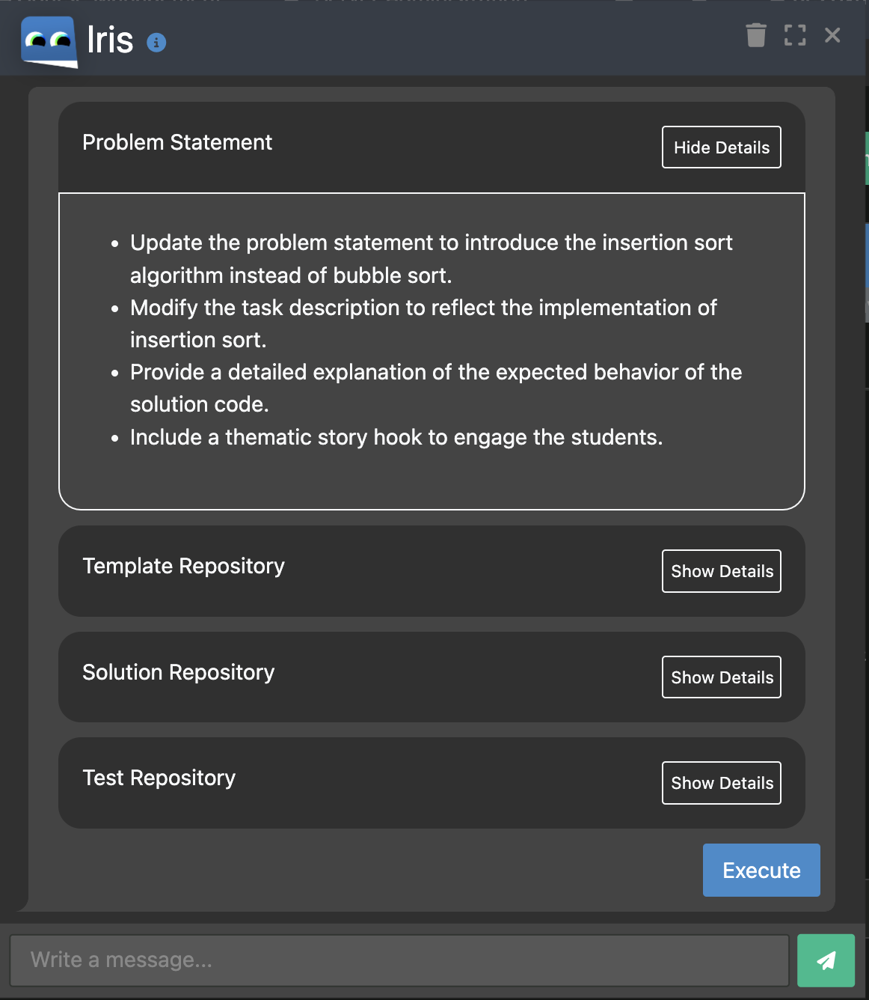
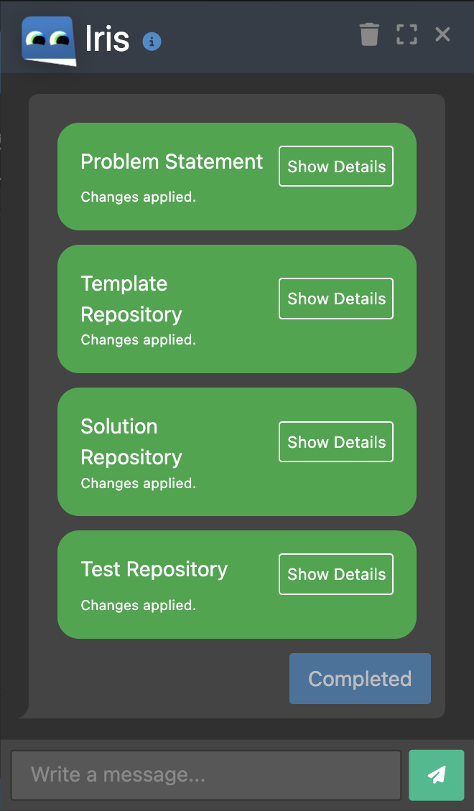

- hi welcome to the experiment on iris for exercise creation
- you will be using iris as assistant to apply changes to programming exercises
- in general, here's how it works
    - enter a request
    - insepct the action plan
    - accept it or request changes
    - wait until the changes are applied
    - inspect the changes; ask it for fixes or apply manual corrections

- while working, please start screen recording! we need a video of your screen
- do not use alternative AI tools during the process

- here are your tasks:
    - experiment 1: your goal is to XYZ, please change the exercise so it ABC
    - experiment 2: ...
    - experiment 3: ...

- after you are done, fill the survey: <link>

---

IRIS, our interactive AI-based assistant chat-bot, one of the main feature is to assist with programming exercise adaptation.

Iris code editor feature:

**F1.1 Communicate with Iris in the *Code Editor***: The user will be able

to communicate with Iris via a chat window on the *Code Editor* page (Figure 1)

**F1.2 Receive, check, execute, pause and resume exercise plan**: exercise plan is for how Iris intends to adapt the exercise according to request. (Figure 2)

**F1.3 View continuous changes in *Code Editor***: Users will be able to view Iris changes in the code editor.

**Experiment 1: Replacing Search Algorithms**

**Task:** Your task is to replace binary searching algorithm with jump searching algorithm within the programming exercise.

**Procedure:**

1. Login Artemis with a tutor account 
2. Go to **Iris Experimental Study Course 2**
3. Choose one of the **Searching algorithm strategy** programming exercise (each tutor needs to choose different exercises) and open it in online editor (click “Edit in editor”)
4. Start to record your screen
5. Go through the four components(problem statement, template repository, solution repository and test repository) of the exercise
6. Communicate with Iris about your request (:replace binary searching algorithm tasks with jump searching algorithm), until Iris provides the exercise plan. Review the plan and either execute it if you are satisfied or provide modification requests to refine the plan. Iterate this process until you are content.
7. Upon completion of the plan execution, examine the changes in the Code Editor. Make any corrections if needed.
8. After adaptation, the build of the template repository should succeed but fail all test cases (0% passed) and the solution repository should pass 100% tests cases.

**Experiment 2: Adding a Creative Theme**

**Task:** Your task is to add a creative theme (e.g. animal, fruit, etc.) to the programming exercise, enhancing its appeal and comprehensibility for students.

**Procedure:**

1. Login Artemis with a tutor account 
2. Go to **Iris Experimental Study Course 2**
3. Choose one of the **Bubble sort algorithm** programming exercise (each tutor needs to choose different exercises)
4. Start to record your screen
5. Go through the four components(problem statement, template repository, solution repository and test repository) of the exercise
6. Communicate with Iris about your request (:add a creative theme (e.g. animal, fruites, etc.) and adjust the exercise accordingly), until Iris provides the exercise plan. Review the plan and either execute it if you are satisfied or provide modification requests to refine the plan. Iterate this process until you are content. 
7. Upon completion of the plan execution, examine the changes in the Code Editor. Make any corrections if needed.
8. After adaptation, the build of the template repository should succeed but fail all test cases (0% passed) and the solution repository should pass 100% tests cases.